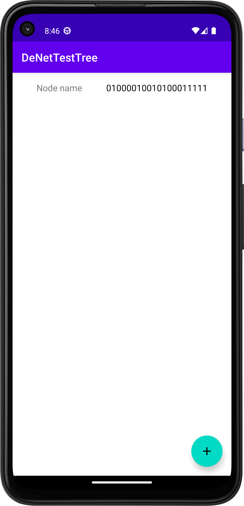
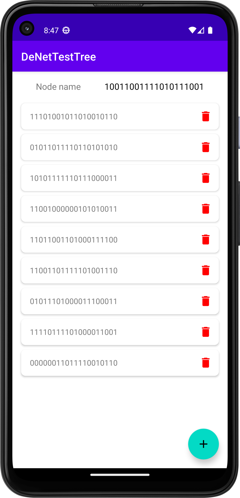
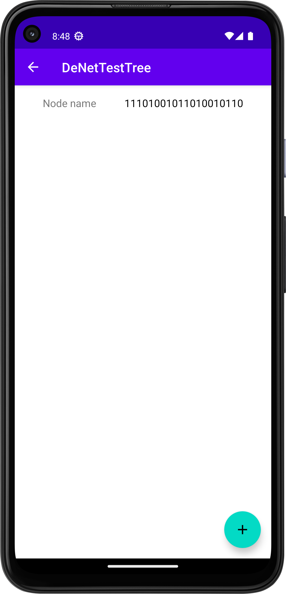
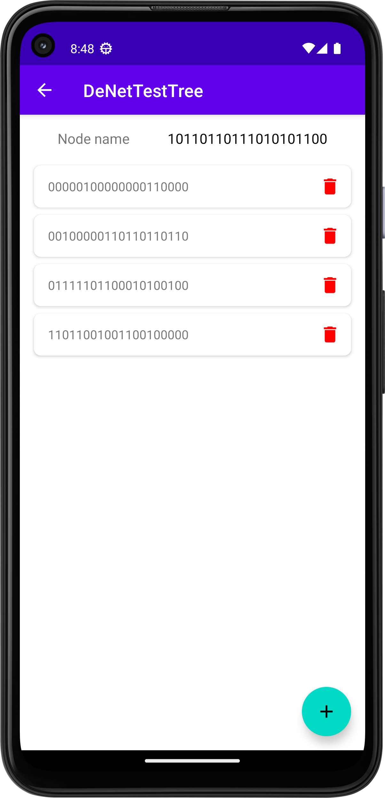
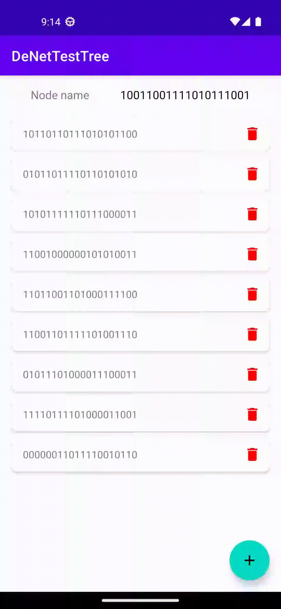

# Тестовое задание от DeNet

## Условия задания:
1. Создать структуру дерева, состоящую из узлов (Node) имеющих, название, детей и ссылку на родителя (такие же узлы)
2.  Написать приложение состоящее из одного экрана с рекурсивной навигацией внутри этого дерева. (Первый экран открывает корневой уровень (root) и далее мы можем пройти в экраны childs)
3. Добавить возможность создания и удалений сущностей на каждом уровне
4. Сохранять состояние дерева на устройстве и подтягивать при следующем входе
5. Название формировать из последних 20 байт хэша узла по аналогии с адресом кошельков Ethereum

## Использованные библиотеки:
* Room - хранение узлов
* Hilt - внедрение зависимостей
* Navigation Component - навигация от узлов к детям

## Реализация

Приложение состоит из единственного активити с одним фрагментом внутри. При первом запуске приложения открывается пустой экран с корневым уровнем. На самом верху располагаются последние 20 бит хэша текущего узла.

При нажатии на FloatingActionButton добавляется потомок и его карточка (последние 20 бит хэша и кнопка удаления).

При нажатии на потомка, открывается экран с его детьми. 

На данном экране также можно добавлять детей. 

При нажатии на кнопку удаления, удаляется узел и всего его потомки.

